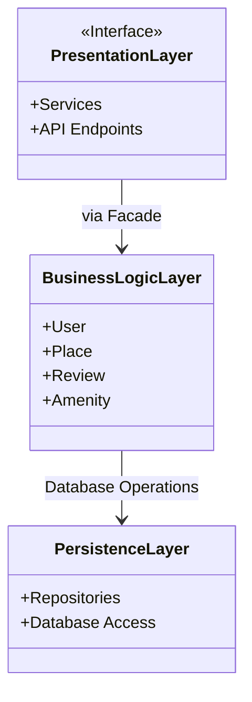
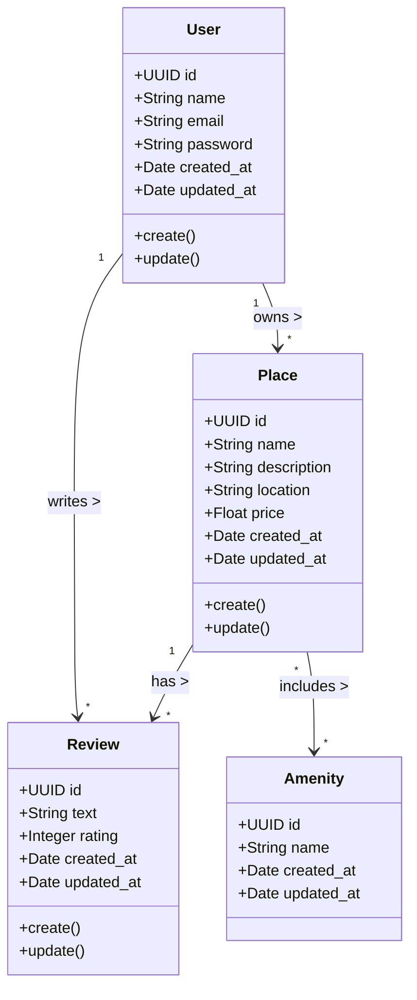
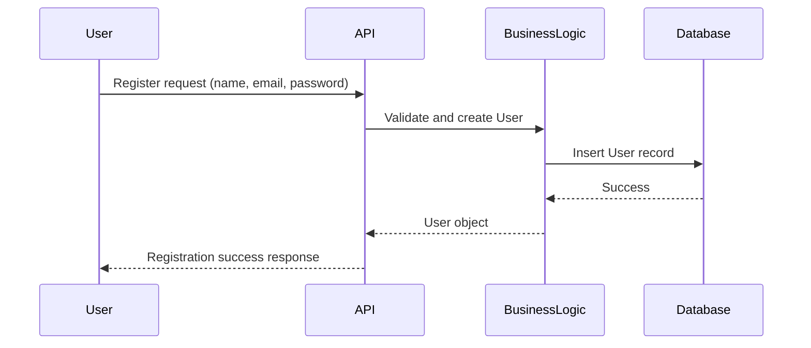
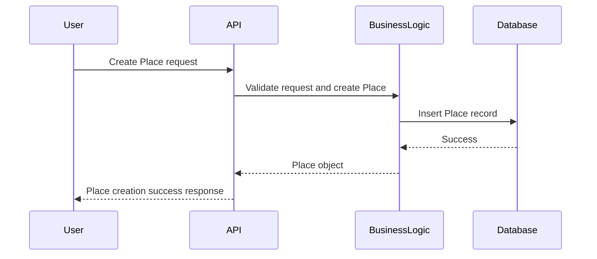
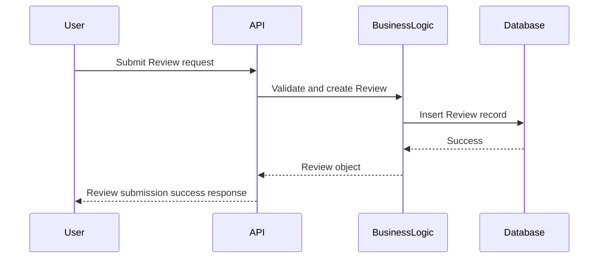
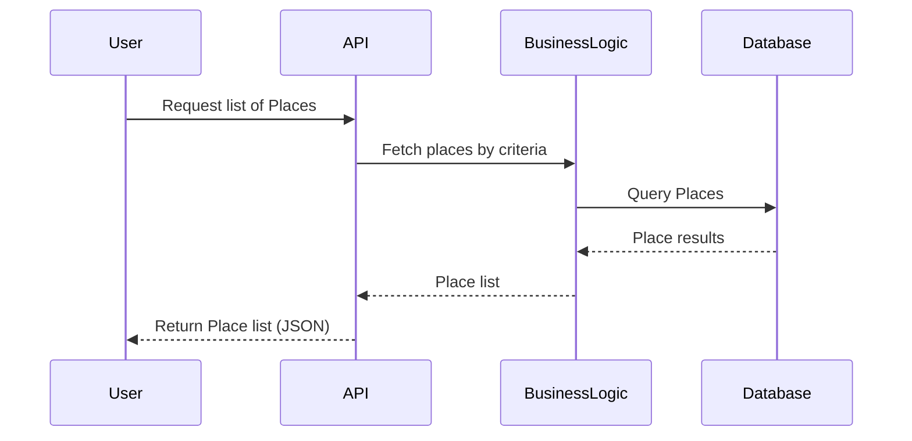

# HBnB – Documentation Technique

## Introduction
Le projet **HBnB** est une application web de location de logements, conçue selon une architecture en trois couches. Ce document technique compile tous les diagrammes et explications nécessaires pour guider l’implémentation du projet.

---

## 1. Architecture générale (Package Diagram)

Ce diagramme illustre la structure en trois couches de l’application et la communication via le pattern Facade.

**Explications :**
- **Presentation Layer** : Fournit les endpoints API et les services aux clients externes. Toutes les requêtes passent par le Facade, qui masque la complexité du système.
- **Business Logic Layer** : Contient les entités principales et les règles métier (validation, relations, contraintes).
- **Persistence Layer** : Gère la communication avec la base de données via des repositories ou DAOs.
- **Pattern Facade** : Simplifie la communication entre la couche présentation et la logique métier.

---

## 2. Diagramme de classes détaillé (Business Logic Layer)

Ce diagramme présente les entités principales, leurs attributs, méthodes et relations.

**Explications :**
- **User** : Représente le client, avec email, mot de passe et opérations de gestion de compte.
- **Place** : Annonce créée par un utilisateur, avec localisation et prix.
- **Review** : Relie un utilisateur à un lieu avec une note et un commentaire.
- **Amenity** : Caractéristique supplémentaire associée à un lieu (Wi-Fi, piscine, etc.).
- **Relations** :
    - Un utilisateur possède plusieurs lieux.
    - Un utilisateur peut écrire plusieurs avis.
    - Un lieu peut avoir plusieurs avis et plusieurs commodités.

---

## 3. Diagrammes de séquence pour les appels API

### 3.1 Inscription utilisateur

### 3.2 Création d’un lieu

### 3.3 Soumission d’un avis

### 3.4 Récupération de la liste des lieux

**Explications :**
Chaque diagramme illustre le cheminement d’une requête depuis l’utilisateur jusqu’à la base de données, en passant par les différentes couches. Cela permet de visualiser la répartition des responsabilités et le flux d’information.

---

## 4. Conclusion

Ce document présente l’architecture, les entités principales et le fonctionnement des appels API du projet HBnB. Il sert de référence pour l’implémentation et la compréhension du système.
Presentation Layer: Provides API endpoints and services to external clients. All calls pass through the Facade, which hides the complexity of the underlying system.

Business Logic Layer: Contains the main entities and business rules (validation, relationships, constraints).

Persistence Layer: Provides repositories or DAOs to manage database communication.

The Facade Pattern ensures that the Presentation Layer only interacts with a single entry point into the Business Logic, simplifying communication.

2. Business Logic Layer – Class Diagram
Diagram
mermaid
Copier le code
classDiagram
class User {
    +UUID id
    +String name
    +String email
    +String password
    +Date created_at
    +Date updated_at
    +create()
    +update()
}

class Place {
    +UUID id
    +String name
    +String description
    +String location
    +Float price
    +Date created_at
    +Date updated_at
    +create()
    +update()
}

class Review {
    +UUID id
    +String text
    +Integer rating
    +Date created_at
    +Date updated_at
    +create()
    +update()
}

class Amenity {
    +UUID id
    +String name
    +Date created_at
    +Date updated_at
}

User "1" --> "*" Place : owns >
User "1" --> "*" Review : writes >
Place "1" --> "*" Review : has >
Place "*" --> "*" Amenity : includes >
Explanation
User: Represents the customer, with attributes like email, password, and operations for account management.

Place: Represents listings created by users, with attributes like location and price.

Review: Links users to places with ratings and comments.

Amenity: Represents additional features (e.g., Wi-Fi, pool) associated with places.

Relationships:

A User can own multiple Places.

A User can write multiple Reviews.

A Place can have multiple Reviews.

A Place can have multiple Amenities.

3. Sequence Diagrams – API Calls
3.1 User Registration
mermaid
Copier le code
sequenceDiagram
participant User
participant API
participant BusinessLogic
participant Database

User->>API: Register request (name, email, password)
API->>BusinessLogic: Validate and create User
BusinessLogic->>Database: Insert User record
Database-->>BusinessLogic: Success
BusinessLogic-->>API: User object
API-->>User: Registration success response
3.2 Place Creation
mermaid
Copier le code
sequenceDiagram
participant User
participant API
participant BusinessLogic
participant Database

User->>API: Create Place request
API->>BusinessLogic: Validate request and create Place
BusinessLogic->>Database: Insert Place record
Database-->>BusinessLogic: Success
BusinessLogic-->>API: Place object
API-->>User: Place creation success response
3.3 Review Submission
mermaid
Copier le code
sequenceDiagram
participant User
participant API
participant BusinessLogic
participant Database

User->>API: Submit Review request
API->>BusinessLogic: Validate and create Review
BusinessLogic->>Database: Insert Review record
Database-->>BusinessLogic: Success
BusinessLogic-->>API: Review object
API-->>User: Review submission success response
3.4 Fetching a List of Places
mermaid
Copier le code
sequenceDiagram
participant User
participant API
participant BusinessLogic
participant Database

User->>API: Request list of Places
API->>BusinessLogic: Fetch places by criteria
BusinessLogic->>Database: Query Places
Database-->>BusinessLogic: Place results
BusinessLogic-->>API: Place list
API-->>User: Return Place list (JSON)
4. Conclusion
This document outlines the architecture and design of the HBnB application:

High-Level Package Diagram shows the layered structure and communication via the Facade Pattern.

Business Logic Layer Class Diagram details the entities, their attributes, methods, and relationships.

Sequence Diagrams provide a step-by-step representation of how API calls flow through the system.

This documentation will serve as the blueprint for the project’s implementation and as a reference guide for developers.
