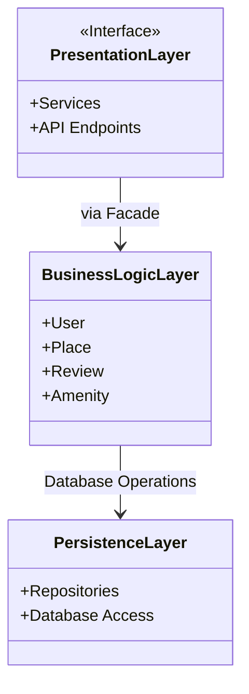
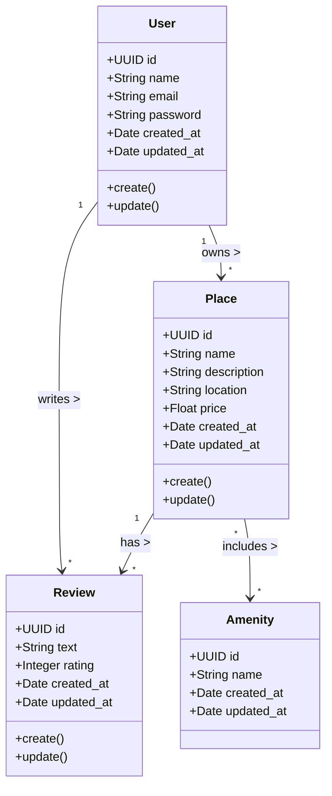

# HBnB – Documentation Technique

## Introduction
Le projet **HBnB** est une application web de location de logements, conçue selon une architecture en trois couches. Ce document technique compile tous les diagrammes et explications nécessaires pour guider l’implémentation du projet.

---

## 1. Architecture générale (Package Diagram)

Ce diagramme illustre la structure en trois couches de l’application et la communication via le pattern Facade.

**Explications :**
- **Presentation Layer** : Fournit les endpoints API et les services aux clients externes. Toutes les requêtes passent par le Facade, qui masque la complexité du système.
- **Business Logic Layer** : Contient les entités principales et les règles métier (validation, relations, contraintes).
- **Persistence Layer** : Gère la communication avec la base de données via des repositories ou DAOs.
- **Pattern Facade** : Simplifie la communication entre la couche présentation et la logique métier.

---

## 2. Diagramme de classes détaillé (Business Logic Layer)

Ce diagramme présente les entités principales, leurs attributs, méthodes et relations.

**Explications :**
- **User** : Représente le client, avec email, mot de passe et opérations de gestion de compte.
- **Place** : Annonce créée par un utilisateur, avec localisation et prix.
- **Review** : Relie un utilisateur à un lieu avec une note et un commentaire.

# 🚀 UML Diags HBnB 🚀

## Diagramme de Packages 📦

### Explication 💡
Ce diagramme montre comment les différentes couches de l’application HBnB sont organisées et interagissent entre elles via le pattern Facade.

### Lexique 📜

#### PresentationLayer : Gère l’interface utilisateur et les interactions
* UserController : Gère les opérations liées aux utilisateurs
* PlaceController : Gère les opérations liées aux lieux
* ReviewController : Gère les opérations liées aux avis
* AmenityController : Gère les opérations liées aux commodités

#### BusinessLogicLayer : Contient la logique principale de l’application
* ApplicationFacade : Interface simplifiée pour la couche présentation

#### Services : Fournit des services spécifiques à chaque entité
* UserService : Gère la logique métier des utilisateurs
* PlaceService : Gère la logique métier des lieux
* ReviewService : Gère la logique métier des avis
* AmenityService : Gère la logique métier des commodités

#### PersistenceLayer : Gère le stockage et la récupération des données
* UserRepository : Accès aux données utilisateur
* PlaceRepository : Accès aux données des lieux
* ReviewRepository : Accès aux données des avis
* AmenityRepository : Accès aux données des commodités

---

## Diagramme de Classes 📐

### Explication 💡
Le diagramme de classes illustre la structure du système en montrant les classes, leurs attributs, opérations et relations.

### Lexique 📜

#### Classes
* BaseModel : Classe parente de toutes les entités
* User : Représente les utilisateurs
* Place : Représente les hébergements
* Review : Représente les avis des utilisateurs
* Amenity : Représente les services ou commodités des lieux

#### Attributs
* Caractéristiques de chaque classe (ex : first_name, price, rating)
* Notés par + pour la visibilité publique

#### Méthodes
* Opérations réalisables sur les instances (ex : register(), update())
* Notées par + pour la visibilité publique

#### Relations
* Héritage : Flèche du fils vers le parent (ex : User vers BaseModel)
* Association : Ligne entre les classes (ex : User vers Place)
* Multiplicité : Chiffres ou symboles aux extrémités (ex : "1" et "*")

---

## 📈 Diagrammes de Séquence 📈

### Inscription utilisateur 📈
![alt text][def]

#### Explication 💡
Ce diagramme illustre le processus d’inscription utilisateur. La requête passe par l’API, est validée par la couche métier, puis enregistrée en base. Les cas d’erreur sont aussi gérés.

#### Lexique 📜
* Client : Utilisateur ou application initiant l’inscription
* API (Présentation) : Point d’entrée recevant la requête
* Business Logic : Partie qui traite les règles métier
* Database (Persistance) : Où les données sont stockées
* POST /users : Méthode HTTP pour l’inscription
* createUser() : Fonction de création d’utilisateur
* validateData() : Vérification des données
* saveUser() : Sauvegarde en base
* 201 Created : Succès
* 400 Bad Request : Données invalides
* 500 Internal Server Error : Erreur serveur

---

## Création d’un lieu 📈

### Explication 💡
Ce diagramme illustre la création d’un nouveau lieu. La requête est traitée par l’API, validée, puis enregistrée en base. Les erreurs sont prises en compte.

### Lexique 📜
* Client : Utilisateur initiant la création
* API (Présentation) : Point d’entrée
* Business Logic : Règles métier
* Database (Persistance) : Stockage des lieux
* POST /places : Méthode HTTP
* createPlace() : Création du lieu
* validateData() : Vérification
* savePlace() : Sauvegarde
* 201 Created : Succès
* 400 Bad Request : Données invalides
* 500 Internal Server Error : Erreur serveur
* confirmSave() : Confirmation
* placeCreated : Message de succès
* validationError : Erreur de validation
* dbError : Erreur base

---

## Soumission d’un avis 📈

### Explication 💡
Ce diagramme montre la soumission d’un avis pour un lieu. Il inclut la vérification de l’existence du lieu avant l’enregistrement. Les erreurs sont gérées.

### Lexique 📜
* Client : Utilisateur soumettant l’avis
* API (Présentation) : Point d’entrée
* Business Logic : Règles métier
* Database (Persistance) : Stockage
* POST /places/{id}/reviews : Méthode HTTP
* createReview() : Création de l’avis
* validateData() : Vérification
* verifyPlaceExistence() : Vérification du lieu
* saveReview() : Sauvegarde
* 201 Created : Succès
* 404 Not Found : Lieu inexistant
* 400 Bad Request : Données invalides
* 500 Internal Server Error : Erreur serveur
* placeExists : Confirmation
* reviewCreated : Succès
* placeNotFound : Erreur lieu
* validationError : Erreur validation
* dbError : Erreur base

---

## Récupération de la liste des lieux 📈

### Explication 💡
Ce diagramme illustre la récupération d’une liste de lieux selon des critères. Il montre le traitement à travers les couches et la gestion des cas d’absence de résultats ou d’erreur.

### Lexique 📜
* Client : Utilisateur demandant la liste
* API (Présentation) : Point d’entrée
* Business Logic : Règles métier
* Database (Persistance) : Stockage
* GET /places : Méthode HTTP
* searchPlaces() : Recherche
* retrievePlaces() : Récupération
* filterPlaces() : Filtrage
* 200 OK : Succès
* 204 No Content : Aucun résultat
* 500 Internal Server Error : Erreur serveur
* placeList : Liste initiale
* filteredPlaces : Liste filtrée
* emptyList : Aucun lieu
* noPlacesFound : Message d’absence
* dbError : Erreur base
* retrievalError : Erreur récupération

---

# 📖 Lexique général HBnB 📖

## Concepts clés 🧠
* Architecture en couches : Séparation en Présentation, Métier, Persistance
* Pattern Facade : Interface simplifiée entre les couches
* UML : Langage de modélisation
* API : Interface de programmation
* Opérations CRUD : Create, Read, Update, Delete

## Entités principales 🔑
* User : Utilisateur
* Place : Hébergement
* Review : Avis
* Amenity : Commodité
* BaseModel : Classe de base commune

## Couches 🧱
* Présentation : Interaction utilisateur, endpoints API
* Métier : Logique et modèles
* Persistance : Stockage et accès aux données

## Types de diagrammes 📈
* Package : Organisation en packages/couches
* Classe : Structure des classes et relations
* Séquence : Interactions temporelles

## Attributs & Méthodes communs 🔧
* id (UUID) : Identifiant unique
* created_at : Date de création
* updated_at : Date de mise à jour
* create(), update(), delete(), list() : Méthodes principales

## Symboles UML ♾️
* '<<Interface>>' : Interface
* '+' : Public
* '-->' : Association
* '--|>' : Héritage
* 'o--' : Composition

## Termes généraux 📚
* Repository : Accès aux données
* DTO : Transfert de données
* ORM : Mapping objet-relationnel
* Endpoint : URL API

---

Ce lexique et ces diagrammes servent de référence pour comprendre la documentation et l’architecture du projet HBnB.

[def]: diag.sequence.1.drawio.png
4. Conclusion
