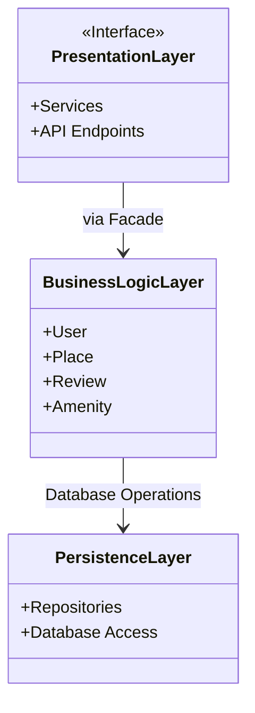
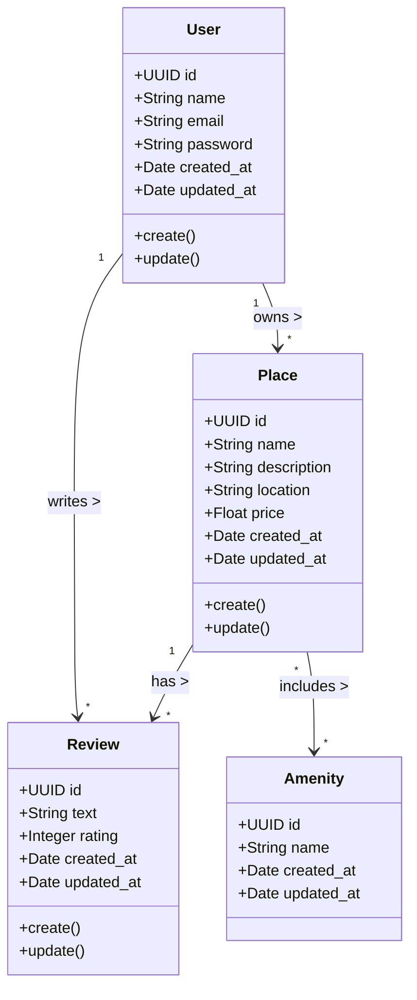

# HBnB – Documentation Technique

## Introduction
The **HBnB** project is a web-based housing rental application designed using a three-layer architecture. This technical document compiles all the diagrams and explanations needed to guide the project's implementation.

---

## 1. General Architecture (Package Diagram)

This diagram illustrates the three-layer structure of the application and communication via the Facade pattern.

**Explanations:**
- **Presentation Layer**: Provides API endpoints and services to external clients. All requests pass through the Facade, which hides the system's complexity.
- **Business Logic Layer**: Contains the core entities and business rules (validation, relationships, constraints).
- **Persistence Layer**: Manages communication with the database via repositories or DAOs.
- **Pattern Facade**: Simplifies communication between the presentation layer and business logic.

---

## 2. Detailed Class Diagram (Business Logic Layer)

This diagram shows the main entities, their attributes, methods and relationships.

**Explanations:**
- **User**: Represents the customer, with email, password, and account management options.
- **Place**: Listing created by a user, with location and price.
- **Review**: Links a user to a place with a rating and comment.

# 🚀 UML Diags HBnB 🚀

## Package Diagram 📦

### Explanation 💡
This diagram shows how the different layers of the HBnB application are organized and interact with each other via the Facade pattern.

### Glossary 📜

#### PresentationLayer: Manages the user interface and interactions
* UserController: Handles user-related operations
* PlaceController: Handles place-related operations
* ReviewController: Handles review-related operations
* AmenityController: Handles amenity-related operations

#### BusinessLogicLayer: Contains the main logic of the application
* ApplicationFacade: Simplified interface for the presentation layer

#### Services: Provides specific services for each entity
* UserService: Manages business logic for users
* PlaceService: Manages business logic for places
* ReviewService: Manages business logic for reviews
* AmenityService: Manages business logic for amenities

#### PersistenceLayer: Manages data storage and retrieval
* UserRepository: Access to user data
* PlaceRepository: Access to place data
* ReviewRepository: Access to review data
* AmenityRepository: Access to amenity data

---

## Class Diagram 📐

### Explanation 💡
The class diagram illustrates the system structure by showing classes, their attributes, operations, and relationships.

### Glossary 📜

#### Classes
* BaseModel: Parent class for all entities
* User: Represents users
* Place: Represents accommodations
* Review: Represents user reviews
* Amenity: Represents features or amenities of places

#### Attributes
* Characteristics of each class (e.g., first_name, price, rating)
* Denoted by + for public visibility

#### Methods
* Operations that can be performed on instances (e.g., register(), update())
* Also denoted by + for public visibility

#### Relationships
* Inheritance: Arrow from child to parent (e.g., User to BaseModel)
* Association: Line between classes (e.g., User to Place)
* Multiplicity: Numbers or symbols at line ends (e.g., "1" and "*")

---

## 📈 Sequence Diagrams 📈

### User Registration 📈

#### Explanation 💡
This diagram illustrates the user registration process. The request goes through the API, is validated by the business layer, and then saved in the database. Error cases are also handled.

#### Glossary 📜
* Client: The user or application initiating registration
* API (Presentation): Entry point receiving the request
* Business Logic: Processes business rules
* Database (Persistence): Where data is stored
* POST /users: HTTP method for registration
* createUser(): Function to create a user
* validateData(): Data validation
* saveUser(): Save to database
* 201 Created: Success
* 400 Bad Request: Invalid data
* 500 Internal Server Error: Server error

---

## Place Creation 📈

### Explanation 💡
This diagram illustrates the process of creating a new place. The request is processed by the API, validated, and then saved in the database. Error scenarios are handled.

### Glossary 📜
* Client: User initiating creation
* API (Presentation): Entry point
* Business Logic: Business rules
* Database (Persistence): Place storage
* POST /places: HTTP method
* createPlace(): Create place
* validateData(): Validation
* savePlace(): Save
* 201 Created: Success
* 400 Bad Request: Invalid data
* 500 Internal Server Error: Server error
* confirmSave(): Confirmation
* placeCreated: Success message
* validationError: Validation error
* dbError: Database error

---

## Review Submission 📈

### Explanation 💡
This diagram shows the process of submitting a review for a place. It includes verifying the existence of the place before saving the review. Errors are handled.

### Glossary 📜
* Client: User submitting the review
* API (Presentation): Entry point
* Business Logic: Business rules
* Database (Persistence): Storage
* POST /places/{id}/reviews: HTTP method
* createReview(): Create review
* validateData(): Validation
* verifyPlaceExistence(): Check place existence
* saveReview(): Save
* 201 Created: Success
* 404 Not Found: Place not found
* 400 Bad Request: Invalid data
* 500 Internal Server Error: Server error
* placeExists: Confirmation
* reviewCreated: Success
* placeNotFound: Place error
* validationError: Validation error
* dbError: Database error

---

## Retrieval of Place List 📈

### Explanation 💡
This diagram illustrates the retrieval of a list of places based on criteria. It shows processing through layers and handling cases of no results or errors.

### Glossary 📜
* Client: User requesting the list
* API (Presentation): Entry point
* Business Logic: Business rules
* Database (Persistence): Storage
* GET /places: HTTP method
* searchPlaces(): Search
* retrievePlaces(): Retrieve
* filterPlaces(): Filter
* 200 OK: Success
* 204 No Content: No result
* 500 Internal Server Error: Server error
* placeList: Initial list
* filteredPlaces: Filtered list
* emptyList: No places
* noPlacesFound: No match message
* dbError: Database error
* retrievalError: Retrieval error

---

# 📖 HBnB General Glossary 📖

## Core Concepts 🧠
* Layered Architecture: Separation into Presentation, Business, Persistence
* Facade Pattern: Simplified interface between layers
* UML: Modeling language
* API: Programming interface
* CRUD Operations: Create, Read, Update, Delete

## Key Entities 🔑
* User: User
* Place: Accommodation
* Review: Review
* Amenity: Amenity
* BaseModel: Common base class

## Layers 🧱
* Presentation: User interaction, API endpoints
* Business: Logic and models
* Persistence: Data storage and access

## Diagram Types 📈
* Package: Organization into packages/layers
* Class: Structure and relationships
* Sequence: Temporal interactions

## Common Attributes & Methods 🔧
* id (UUID): Unique identifier
* created_at: Creation date
* updated_at: Update date
* create(), update(), delete(), list(): Main methods

## UML Symbols ♾️
* '<<Interface>>': Interface
* '+': Public
* '-->': Association
* '--|>': Inheritance
* 'o--': Composition

## General Terms 📚
* Repository: Data access
* DTO: Data transfer
* ORM: Object-relational mapping
* Endpoint: API URL

---

[def]: diag.sequence.1.drawio.png
4. Conclusion

This glossary and these diagrams serve as a reference to understand the documentation and architecture of the HBnB project.

AUTHORS: 
https://github.com/h7k2
https://github.com/zoulouhh
